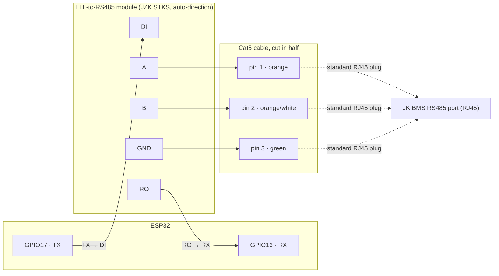

# JKBMS Ghost Battery (ESPHome)

An ESPHome external component that spoofs a "ghost" battery on a JK BMS RS485 parallel bus, so
the master BMS's own SoC/coulomb-counter logic can run to completion instead of the inverter
cutting charging short the moment SoC first (and often incorrectly) reads 100%.

Runs on a generic ESP32 + a TTL-to-RS485 transceiver (this build uses a JZK STKS auto-direction
module — an old-style MAX485 module with manual DE/RE control works too), flashes and updates
through the [ESPHome](https://esphome.io) Dashboard, and integrates natively with Home Assistant.

## The problem this solves

A JK master BMS (RS485 address `0`) aggregates the whole parallel battery array and reports a
combined SoC to the inverter. If the inverter stops charging the instant it sees 100%, the pack
never reaches a true full-charge condition — which is exactly the condition the JK BMS needs to
reset coulomb-counting drift and let its cells top-balance. Over time this drift means SoC can
report 100% when the pack is actually far from full.

The fix: add a "ghost" battery at an unused RS485 address (`15` by default). Its presence in the
array's SoC calculation keeps the reported SoC below 100% until the real packs are genuinely
full and balanced — at which point the ghost releases the 100% signal for real, and the inverter
stops charging on a signal that's actually true.

Based on the [JKBMS Inverter BMS SoC Fixer — "Ghost Battery" — Open Hardware
Project](https://diysolarforum.com/threads/jkbms-inverter-bms-soc-fixer-ghost-battery-open-hardware-project.88554/)
on DIY Solar Forum. RS485 frame handling inspired by
[ModbusRTUSlave](https://github.com/CMB27/ModbusRTUSlave); frame-format details cross-referenced
against [txubelaxu/esphome-jk-bms](https://github.com/txubelaxu/esphome-jk-bms).

## How the release logic works

This variant gates the SoC release on real per-cell data instead of a fixed timer:

1. The ghost starts **holding** (reports 0% SoC, 0 Ah remaining) — this blocks the array from
   ever reading 100%.
2. It passively sniffs both real packs' own status responses as they pass by on the bus and
   tracks each pack's min/max cell voltage and reported SoC.
3. Once **every cell on both packs** is at or above `cell_full_low_mv` (default 3.46V) **and**
   each pack's own highest-lowest cell spread is within `cell_balance_tolerance_mv` (default
   20mV), the ghost releases: it reports 100% SoC and full capacity, so the inverter gets a
   genuine full-charge signal and stops charging.
4. As soon as pack 1 or pack 2's own reported SoC drops to `reset_soc_percent` (default 99%) —
   ie. discharging has started — the ghost re-arms back to holding, ready for the next cycle.
5. `hold_failsafe_minutes` (default 240) is a safety backstop: if balance/full can never be
   confirmed (wrong address, wiring problem), the hold releases anyway after this long, so a
   configuration mistake can't cause indefinite overcharge. Set to `0` to disable.

## ⚠️ Safety notes

This controls a real signal in a real charging system. Before trusting it unattended:

- **Verify `pack1_address` and `pack2_address`** against your BMS's actual dip switch settings.
  Wrong addresses mean the ghost never sees real data and never releases.
- **Watch the logs first.** With `logger: level: DEBUG`, confirm you see `Pack 0x00 cells: ...`
  and `Pack 0x01 cells: ...` for both real packs before leaving it running unattended.
- **Tune `cell_full_low_mv` and `cell_balance_tolerance_mv` to your cells**, not the defaults
  here — they were reverse-engineered from one specific pack (see
  [Protocol notes](#protocol-notes)) and won't necessarily suit yours.
- Provided as-is, without warranty. You are responsible for your own battery system.

## Hardware

- Any ESP32 dev board.
- A TTL-to-RS485 transceiver. This build uses a **JZK STKS** module, which senses transmit/receive
  direction automatically — no `de_pin` needed. An old-style MAX485/SP3485 breakout with separate
  DE/RE pins (tied together, driven from a GPIO) works too; see `de_pin` in the config reference.
- Wired onto the JK RS485 parallel bus, at an address with **no physical battery** (`15` by
  default).
- 115200 baud, 8N1.

### Wiring



| ESP32 | Module | Cat5 pin | Wire |
|---|---|---|---|
| GPIO17 (TX) | DI | — | — |
| GPIO16 (RX) | RO | — | — |
| 3V3/5V | VCC | — | — |
| GND | GND | — | — |
| — | A | pin 1 | orange |
| — | B | pin 2 | orange/white |
| — | GND | pin 3 | green |

Using an old-style MAX485 module instead? Add a `GPIO4 → DE + RE (tied together)` connection and
set `de_pin: GPIO4` in the YAML (see [Configuration reference](#configuration-reference)).

The Cat5 cable's other end is a standard, unmodified RJ45 plug into the BMS's RS485 port — same
connector the JK Windows tool or Solar Assistant would use.

> Check your specific module's datasheet before tying VCC to 3.3V — most read DI/RO (and DE/RE,
> if present) fine at 3.3V logic even when VCC itself needs 5V, but that varies by board.
>
> Unlike the M5Stack RS485 base (which has internal pulldowns), a bare RS485 module needs the
> ground wire (pin 3, green) connected for reliable communication.

### Soldering / assembly

Tools: soldering iron + solder, wire strippers, heat-shrink tubing (or electrical tape), a
multimeter for continuity checks, and a lighter/heat gun for the heat-shrink.

1. **ESP32 → module.** If your module only has bare through-hole pads for DI/RO/VCC/GND, solder
   short wires (or a 4-pin header, if you'd rather use Dupont jumpers) onto DI, RO, VCC and GND.
   Solder the other ends directly to the ESP32's GPIO17, GPIO16, 3V3/5V and GND pins, or to
   headers on the dev board if it has them — no need to solder straight to the board itself if
   pin headers are already populated.
2. **Prepare the Cat5 cable.** Cut a Cat5/Cat5e cable roughly in half. On the BMS end, leave the
   factory RJ45 plug untouched. On the module end, strip ~3cm of outer jacket, untwist the pairs,
   and identify pins 1 (orange), 2 (orange/white) and 3 (green) by the standard T568 colors. You
   only need these three wires — trim the other five short so they can't short anything.
3. **Connect A/B/GND to the module.** Strip ~5mm of insulation off pins 1, 2 and 3 and tin them
   with a light coat of solder.
   - **Screw-terminal module:** loosen the terminal screws, insert pin 1 → `A`, pin 2 → `B`,
     tighten. No soldering needed here.
   - **Solder-pad module:** solder pin 1 to the `A` pad and pin 2 to the `B` pad directly.
   - Either way, solder (or terminal-connect) pin 3 to the module's `GND` pad/terminal.
4. **Insulate every joint.** Slide heat-shrink over each solder joint before soldering the next
   one (easy to forget), then shrink it once cool. This sits next to a battery bank — a stray
   strand shorting `A` to `GND`, or two 5V/GND wires touching, is worth the extra minute.
5. **Check before powering on.** With everything unpowered, use a multimeter in continuity mode
   to confirm: `A` and `B` aren't shorted to each other or to `GND`, and there's no continuity
   between your 5V/VCC wire and `GND`. Then power up and plug the RJ45 end into the BMS.

## Installation

1. Copy this whole folder (including `components/`) into your ESPHome Dashboard's config
   directory, eg. `/config/esphome/`, keeping the folder structure intact — `external_components`
   in the YAML resolves `path: components` relative to the YAML file.
2. Copy `secrets.yaml` alongside it (or merge its keys into your existing one) and fill in your
   real WiFi credentials, a generated API encryption key, and an OTA password.
3. In the ESPHome Dashboard, open `jkbms-ghost-battery.yaml` and click **Validate** — it should
   list the full resolved config ending in `Configuration is valid!` with no errors. If it can't
   find the component, double check the folder name is exactly `components/jkbms_ghost_battery/`
   (case-sensitive on Linux).
4. Click **Install** for the first flash (USB required); later updates can go out over WiFi/OTA.
5. Once online, Home Assistant will show a discovery notification for the device automatically
   (**Settings → Devices & services**) — no manual YAML editing needed on the HA side.

## Configuration reference

```yaml
jkbms_ghost_battery:
  uart_id: jkbms_uart
  # de_pin is optional - omit it for an auto-direction module (eg. JZK STKS). Only needed for an
  # old-style MAX485 module with separate DE+RE pins tied together:
  # de_pin: GPIO4
  ghost_address: 15       # must be an address with no physical battery
  pack1_address: 0        # real master BMS address
  pack2_address: 1        # real pack 2 address - verify against your dip switches
  cell_full_low_mv: 3460        # every cell, both packs, must be at/above this voltage (mV)...
  cell_balance_tolerance_mv: 20 # ...AND each pack's own max-min cell spread must be within this
                                 # many mV - together, "full" and "balanced"
  reset_soc_percent: 99   # re-arms the hold once pack1 or pack2's real SoC drops to this value
  hold_failsafe_minutes: 240  # safety backstop; releases anyway if balance is never confirmed. 0 disables it

sensor:
  - platform: jkbms_ghost_battery
    pack1_min_cell_voltage:
      name: "Pack 1 min cell voltage"
    pack1_max_cell_voltage:
      name: "Pack 1 max cell voltage"
    pack2_min_cell_voltage:
      name: "Pack 2 min cell voltage"
    pack2_max_cell_voltage:
      name: "Pack 2 max cell voltage"
    pack1_soc:
      name: "Pack 1 SoC"
    pack2_soc:
      name: "Pack 2 SoC"
    ghost_fake_soc:
      name: "Ghost fake SoC"   # what the ghost is currently telling the bus: 0 or 100

switch:
  - platform: jkbms_ghost_battery
    manual_override_armed:
      name: "Ghost manual override armed"
      restore_mode: ALWAYS_OFF
    manual_force_full:
      name: "Ghost force 100%"
      restore_mode: ALWAYS_OFF
```

All `sensor:` and `switch:` entries are optional individually — omit any you don't want.

## Home Assistant entities

**`sensor:`** — pack 1/2 min & max cell voltage, pack 1/2 real SoC, and **ghost fake SoC** (7
sensors). The first six are useful for watching your thresholds live and tuning
`cell_full_low_mv`/`cell_balance_tolerance_mv` from actual graphs instead of guessing.
`ghost_fake_soc` is the direct answer to "what is the fake battery doing right now" — it publishes
exactly the 0 or 100 the ghost is telling the bus at that moment, updated every time it answers a
status request.

**`switch:`** — a manual override, deliberately built as a two-step interlock so it can't be
triggered by accident:
- **`manual_override_armed`** must be switched on first. While off, the automatic cell-balance
  logic keeps running exactly as described above, untouched.
- **`manual_force_full`** only does anything once armed: on forces the ghost to report 100%, off
  forces it to report 0%. Flipping it while disarmed does nothing.

Both switches use `restore_mode: ALWAYS_OFF` in the example config — every reboot always comes
back up disarmed and fully automatic, the same way `holding_` itself always starts at 0% on boot.

## Protocol notes

Every JK RS485 status frame (`0x20`) is a fixed 308-byte packet. The fields this component reads
and/or patches were reverse engineered directly from a real capture (a JK PB2A16S30P V19A, 16S
LiFePO4, address `0x0F`) and cross-checked against
[esphome-jk-bms](https://github.com/txubelaxu/esphome-jk-bms):

| Field | Byte offset | Format |
|---|---|---|
| Cell voltages (16 cells) | 6–37 | 2 bytes little-endian, mV, one pair per cell |
| SoC | 173 | 1 byte, percent |
| Remaining capacity | 174–177 | 4 bytes little-endian, mAh |
| Total capacity | 178–181 | 4 bytes little-endian, mAh |
| Internal payload checksum | 299 | 1 byte, sum of bytes 0–298 mod 256 |
| Source address (trailer echo) | 300 | 1 byte |

Any time the SoC/capacity bytes are patched, byte 299 is recomputed — otherwise the frame gets
silently rejected downstream.

## Battery bank this was built/tested against

Yixiang 34kWh (EVE MB56 cells), JK PB2A16S30P V19A BMS.
