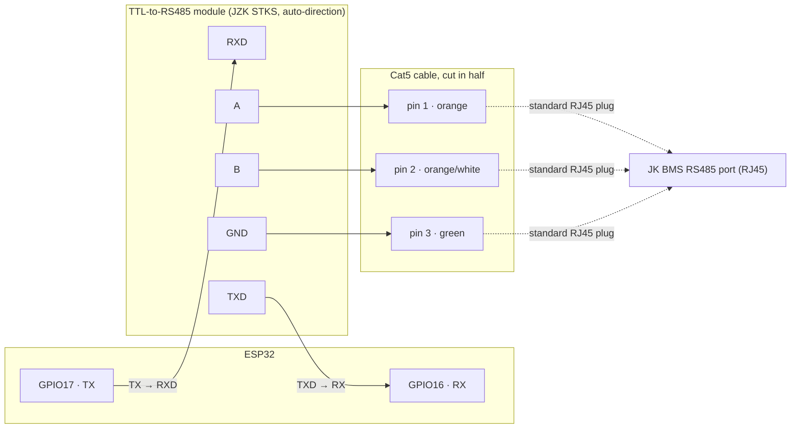

# JKBMS Ghost Battery (ESPHome)

An ESPHome external component that spoofs a "ghost" battery on a JK BMS RS485 parallel bus, so
the master BMS's own SoC/coulomb-counter logic can run to completion instead of the inverter
cutting charging short the moment SoC first (and often incorrectly) reads 100%.

Runs on a generic ESP32 + a TTL-to-RS485 transceiver (this build uses a JZK STKS auto-direction
module — an old-style MAX485 module with manual DE/RE control works too), flashes and updates
through the [ESPHome](https://esphome.io) Dashboard, and integrates natively with Home Assistant.

## The problem this solves

A JK master BMS (RS485 address `0`) aggregates the whole parallel battery array and reports a
combined SoC to the inverter. If the inverter stops charging the instant it sees 100%, the pack
never reaches a true full-charge condition — which is exactly the condition the JK BMS needs to
reset coulomb-counting drift and let its cells top-balance. Over time this drift means SoC can
report 100% when the pack is actually far from full.

The fix: add a "ghost" battery at an unused RS485 address (`15` by default). Its presence in the
array's SoC calculation keeps the reported SoC below 100% until the real packs are genuinely
full and balanced — at which point the ghost releases the 100% signal for real, and the inverter
stops charging on a signal that's actually true.

Based on the [JKBMS Inverter BMS SoC Fixer — "Ghost Battery" — Open Hardware
Project](https://diysolarforum.com/threads/jkbms-inverter-bms-soc-fixer-ghost-battery-open-hardware-project.88554/)
on DIY Solar Forum. RS485 frame handling inspired by
[ModbusRTUSlave](https://github.com/CMB27/ModbusRTUSlave); frame-format details cross-referenced
against [txubelaxu/esphome-jk-bms](https://github.com/txubelaxu/esphome-jk-bms).

## How the release logic works

This variant gates the SoC release on real per-cell data instead of a fixed timer. Works with
either one or two real packs — set `pack_count` accordingly (see
[Configuration reference](#configuration-reference)); everything below just says "the pack(s)"
since the logic is identical either way, minus pack 2 in single-pack mode:

1. The ghost starts **holding** (reports 0% SoC, 0 Ah remaining) — this blocks the array from
   ever reading 100%.
2. It passively sniffs the real pack(s)' own status responses as they pass by on the bus and
   tracks each pack's min/max cell voltage and reported SoC.
3. Once **every cell on every configured pack** is at or above `cell_full_low_mv` (default 3.46V)
   **and** each pack's own highest-lowest cell spread is within `cell_balance_tolerance_mv`
   (default 20mV), the ghost releases: it reports 100% SoC and full capacity, so the inverter
   gets a genuine full-charge signal and stops charging.
4. As soon as any configured pack's own reported SoC drops to `reset_soc_percent` (default 99%) —
   ie. discharging has started — the ghost re-arms back to holding, ready for the next cycle.
5. `hold_failsafe_minutes` (default 240) is a safety backstop: if balance/full can never be
   confirmed (wrong address, wiring problem), the hold releases anyway after this long, so a
   configuration mistake can't cause indefinite overcharge. Set to `0` to disable.
6. `pack_stale_timeout_seconds` (default 30) guards against acting on stale data: if a configured
   pack hasn't sent a fresh status frame within this window (BMS reset, wiring fault, pack
   physically disconnected), its last cached reading is no longer trusted — the ghost won't
   release on the strength of it, and if it had already released, it re-arms back to holding as a
   precaution. Real packs are normally polled every few seconds, so this should stay well above
   that under normal conditions.

## ⚠️ Safety notes

This controls a real signal in a real charging system. Before trusting it unattended:

- **Verify `pack1_address` and `pack2_address`** against your BMS's actual dip switch settings.
  Wrong addresses mean the ghost never sees real data and never releases.
- **Watch the logs first.** With `logger: level: DEBUG`, confirm you see `Pack 0x00 cells: ...`
  and `Pack 0x01 cells: ...` for both real packs before leaving it running unattended.
- **Tune `cell_full_low_mv` and `cell_balance_tolerance_mv` to your cells**, not the defaults
  here — they were reverse-engineered from one specific pack (see
  [Protocol notes](#protocol-notes)) and won't necessarily suit yours.
- Provided as-is, without warranty. You are responsible for your own battery system.

## Hardware

- Any ESP32 dev board.
- A TTL-to-RS485 transceiver. This build uses a **JZK STKS** module, which senses transmit/receive
  direction automatically — no `de_pin` needed. An old-style MAX485/SP3485 breakout with separate
  DE/RE pins (tied together, driven from a GPIO) works too; see `de_pin` in the config reference.
- Wired onto the JK RS485 parallel bus, at an address with **no physical battery** (`15` by
  default).
- 115200 baud, 8N1.

### Wiring



| ESP32 | Module | Cat5 pin | Wire |
|---|---|---|---|
| GPIO17 (TX) | RXD | — | — |
| GPIO16 (RX) | TXD | — | — |
| 3V3/5V | VCC | — | — |
| GND | GND | — | — |
| — | A | pin 1 | orange |
| — | B | pin 2 | orange/white |
| — | GND | pin 3 | green |

Note the crossover: ESP32 **TX** goes to the module's **RXD**, and ESP32 **RX** goes to the
module's **TXD** — same as wiring up any two UART devices. Some modules label these pins `DI`/`RO`
instead (from the RS485 driver chip's own perspective rather than the UART side) — if yours does,
`DI` is what's labeled `RXD` here and `RO` is `TXD`. Either way: connect TX to whichever pin feeds
into the module, and RX to whichever pin comes out of it.

Using an old-style MAX485 module instead? Add a `GPIO4 → DE + RE (tied together)` connection and
set `de_pin: GPIO4` in the YAML (see [Configuration reference](#configuration-reference)).

The Cat5 cable's other end is a standard, unmodified RJ45 plug into the BMS's RS485 port — same
connector the JK Windows tool or Solar Assistant would use.

> Check your specific module's datasheet before tying VCC to 3.3V — most read RXD/TXD (and DE/RE,
> if present) fine at 3.3V logic even when VCC itself needs 5V, but that varies by board.
>
> Unlike the M5Stack RS485 base (which has internal pulldowns), a bare RS485 module needs the
> ground wire (pin 3, green) connected for reliable communication.

### Soldering / assembly

Tools: soldering iron + solder, wire strippers, heat-shrink tubing (or electrical tape), a
multimeter for continuity checks, and a lighter/heat gun for the heat-shrink.

1. **ESP32 → module.** If your module only has bare through-hole pads for RXD/TXD/VCC/GND
   (labeled `DI`/`RO` on some boards), solder short wires (or a 4-pin header, if you'd rather use
   Dupont jumpers) onto those four pads. Solder the other ends to the ESP32's GPIO17 (TX) →
   module RXD/DI, GPIO16 (RX) → module TXD/RO, 3V3/5V → VCC and GND → GND — or to headers on the
   dev board if it has them already, no need to solder straight to the board itself.
2. **Prepare the Cat5 cable.** Cut a Cat5/Cat5e cable roughly in half. On the BMS end, leave the
   factory RJ45 plug untouched. On the module end, strip ~3cm of outer jacket, untwist the pairs,
   and identify pins 1 (orange), 2 (orange/white) and 3 (green) by the standard T568 colors. You
   only need these three wires — trim the other five short so they can't short anything.
3. **Connect A/B/GND to the module.** Strip ~5mm of insulation off pins 1, 2 and 3 and tin them
   with a light coat of solder.
   - **Screw-terminal module:** loosen the terminal screws, insert pin 1 → `A`, pin 2 → `B`,
     tighten. No soldering needed here.
   - **Solder-pad module:** solder pin 1 to the `A` pad and pin 2 to the `B` pad directly.
   - Either way, solder (or terminal-connect) pin 3 to the module's `GND` pad/terminal.
4. **Insulate every joint.** Slide heat-shrink over each solder joint before soldering the next
   one (easy to forget), then shrink it once cool. This sits next to a battery bank — a stray
   strand shorting `A` to `GND`, or two 5V/GND wires touching, is worth the extra minute.
5. **Check before powering on.** With everything unpowered, use a multimeter in continuity mode
   to confirm: `A` and `B` aren't shorted to each other or to `GND`, and there's no continuity
   between your 5V/VCC wire and `GND`. Then power up and plug the RJ45 end into the BMS.

## Installation

1. Copy this whole folder (including `components/`) into your ESPHome Dashboard's config
   directory, eg. `/config/esphome/`, keeping the folder structure intact — `external_components`
   in the YAML resolves `path: components` relative to the YAML file.
2. Copy `secrets.yaml.example` to `secrets.yaml` alongside it (or merge its keys into your
   existing one) and fill in your real WiFi credentials, a generated API encryption key, an OTA
   password, and a fallback AP password (`ap_fallback_password`, min. 8 characters).
   `secrets.yaml` itself is gitignored - never commit your real credentials.
3. In the ESPHome Dashboard, open `jkbms-ghost-battery.yaml` and click **Validate** — it should
   list the full resolved config ending in `Configuration is valid!` with no errors. If it can't
   find the component, double check the folder name is exactly `components/jkbms_ghost_battery/`
   (case-sensitive on Linux).
4. Click **Install** for the first flash (USB required); later updates can go out over WiFi/OTA.
5. Once online, Home Assistant will show a discovery notification for the device automatically
   (**Settings → Devices & services**) — no manual YAML editing needed on the HA side.

If the device ever can't reach your WiFi (eg. you changed the password), it falls back to
broadcasting a **"JKBMS Ghost Battery Fallback"** hotspot. Connect to it with a phone using the
`ap_fallback_password` from your `secrets.yaml`, and a captive portal page lets you enter new
WiFi credentials — no reflashing needed.

## Configuration reference

```yaml
jkbms_ghost_battery:
  uart_id: jkbms_uart
  # de_pin is optional - omit it for an auto-direction module (eg. JZK STKS). Only needed for an
  # old-style MAX485 module with separate DE+RE pins tied together:
  # de_pin: GPIO4
  ghost_address: 15       # must be an address with no physical battery
  pack_count: 2           # 1 or 2 - set to 1 for a single-pack setup (pack2_address below is
                           # then ignored entirely; no need to remove it)
  pack1_address: 0        # real master BMS address
  pack2_address: 1        # real pack 2 address - verify against your dip switches
  cell_full_low_mv: 3460        # every cell, both packs, must be at/above this voltage (mV)...
  cell_balance_tolerance_mv: 20 # ...AND each pack's own max-min cell spread must be within this
                                 # many mV - together, "full" and "balanced"
  reset_soc_percent: 99   # re-arms the hold once pack1 or pack2's real SoC drops to this value
  hold_failsafe_minutes: 240  # safety backstop; releases anyway if balance is never confirmed. 0 disables it
  pack_stale_timeout_seconds: 30  # a pack with no fresh data for this long is treated as unusable -
                                   # release is refused, and an already-released hold re-arms

sensor:
  - platform: jkbms_ghost_battery
    pack1_min_cell_voltage:
      name: "Pack 1 min cell voltage"
    pack1_max_cell_voltage:
      name: "Pack 1 max cell voltage"
    pack2_min_cell_voltage:
      name: "Pack 2 min cell voltage"
    pack2_max_cell_voltage:
      name: "Pack 2 max cell voltage"
    pack1_cell_voltage_diff:
      name: "Pack 1 cell voltage diff"   # highest cell minus lowest cell in pack 1
    pack2_cell_voltage_diff:
      name: "Pack 2 cell voltage diff"   # highest cell minus lowest cell in pack 2
    pack1_voltage:
      name: "Pack 1 voltage"
    pack2_voltage:
      name: "Pack 2 voltage"
    pack1_current:
      name: "Pack 1 current"   # positive = charging, negative = discharging
    pack2_current:
      name: "Pack 2 current"
    pack1_power:
      name: "Pack 1 power"
    pack2_power:
      name: "Pack 2 power"
    total_power:
      name: "Total power"   # pack1 + pack2 power, straight sum
    total_current:
      name: "Total current"   # pack1 + pack2 current, straight sum
    total_cell_voltage_diff:
      name: "Total cell voltage diff"   # highest cell minus lowest cell across ALL cells, both packs
    pack1_temperature:
      name: "Pack 1 temperature"
    pack2_temperature:
      name: "Pack 2 temperature"
    pack1_soc:
      name: "Pack 1 SoC"
    pack2_soc:
      name: "Pack 2 SoC"
    average_soc:
      name: "Average SoC"   # (pack1 + pack2) / 2
    average_voltage:
      name: "Average voltage"   # (pack1 + pack2) / 2
    ghost_fake_soc:
      name: "Ghost fake SoC"   # what the ghost is currently telling the bus: 0 or 100
    pack1_rcv_voltage:
      name: "Pack 1 RCV"   # rated charge voltage from that pack's settings - read-only, passive
                             # only (updates only if something else on the bus queries it)
    pack2_rcv_voltage:
      name: "Pack 2 RCV"
    # individual cell voltages - pack1_cell_1 .. pack1_cell_16, pack2_cell_1 .. pack2_cell_16
    # (32 total, all optional). See jkbms-ghost-battery.yaml for the full list.
    # These are entity_category: diagnostic, so Home Assistant groups them into the device's
    # collapsible "Diagnostic" section instead of the main sensor list.
    pack1_cell_1:
      name: "Pack 1 Cell 1"
    pack1_cell_2:
      name: "Pack 1 Cell 2"
    # ...

text_sensor:
  - platform: jkbms_ghost_battery
    hold_status:
      name: "Ghost hold status"   # why the ghost is currently holding or released

binary_sensor:
  - platform: jkbms_ghost_battery
    pack1_data_stale:
      name: "Pack 1 data stale"   # on = no fresh reading within pack_stale_timeout_seconds
    pack2_data_stale:
      name: "Pack 2 data stale"

switch:
  - platform: jkbms_ghost_battery
    manual_override_armed:
      name: "Ghost forced SOC enabled"
      restore_mode: ALWAYS_OFF

number:
  - platform: jkbms_ghost_battery
    manual_force_soc:
      name: "Ghost force SOC"
```

All `sensor:`, `text_sensor:`, `binary_sensor:` and `switch:` entries are optional individually —
omit any you don't want.

## Home Assistant entities

**`sensor:`** — 56 sensors, read passively off real traffic already on the bus (the ghost never
queries anything itself for these):
- Per pack (1 and 2): min/max cell voltage, cell voltage diff (max - min, ie. how far out of
  balance that pack currently is), total voltage, current (positive = charging, negative =
  discharging), power (voltage × current, kW), temperature, real SoC, and all 16 individual
  cell voltages (`entity_category: diagnostic`, grouped into Home Assistant's collapsible
  "Diagnostic" section on the device page instead of cluttering the main sensor list). Sourced
  from the packs' own status responses, which something on the bus already polls every few
  seconds.
- **`average_soc`** and **`average_voltage`** — the mean of pack 1 and pack 2 (eg. 50% + 60% →
  55%), only published once both packs have been seen at least once.
- **`total_power`** and **`total_current`** — the straight sum of both packs (not an average),
  same "once both packs have been seen" gating.
- **`total_cell_voltage_diff`** — highest cell minus lowest cell across **all** cells on **all**
  configured packs (not per-pack like the diffs above) — the single number that tells you how
  out of balance the whole array is.
- **`ghost_fake_soc`** — the direct answer to "what is the fake battery doing right now": exactly
  the 0 or 100 the ghost is telling the bus at that moment, updated every time it answers a status
  request.
- **`pack1_rcv_voltage`** / **`pack2_rcv_voltage`** — each pack's own RCV (rated charge voltage)
  setting. Read-only and truly passive: the ghost never requests a settings frame itself, so
  these only update if something else on your bus (eg. the JK app, Solar Assistant) happens to
  query that pack's settings. They may simply never update on your setup - that's expected, not
  a bug.

**`text_sensor:`**
- **`hold_status`** — the "why" behind `ghost_fake_soc`'s raw "what". Reports a short reason
  string each time the hold/release decision changes, eg. `"released - balanced and full"`,
  `"released - failsafe (balance not confirmed)"`, `"holding - re-armed (SoC dropped)"`, or
  `"holding - re-armed (data stale)"`. Starts as `"holding - waiting for pack data"` on boot.

**`binary_sensor:`**
- **`pack1_data_stale`** / **`pack2_data_stale`** — on when that pack hasn't sent a fresh status
  frame within `pack_stale_timeout_seconds`. `entity_category: diagnostic`, so these show up in
  the device's collapsible "Diagnostic" section - a good target for a Home Assistant notification
  if you want to be alerted to a wiring or address problem instead of just watching the log.

**`switch:` + `number:`** — a manual override, deliberately built as a two-step interlock so it
can't be triggered by accident:
- **`manual_override_armed`** ("Ghost forced SOC enabled") must be switched on first. While off,
  the automatic cell-balance logic keeps running exactly as described above, untouched.
- **`manual_force_soc`** ("Ghost force SOC") only does anything once armed: a slider from 0-100,
  fixed to a step of 100 so it only ever has two positions — 100 forces the ghost to report
  100%, 0 forces it to report 0%. Moving it while disarmed does nothing.

`manual_override_armed` uses `restore_mode: ALWAYS_OFF` in the example config, and
`manual_force_soc` isn't persisted at all — every reboot always comes back up disarmed and fully
automatic, the same way `holding_` itself always starts at 0% on boot.

## Protocol notes

Every JK RS485 status frame (`0x20`) is a fixed 308-byte packet. The fields this component reads
and/or patches were reverse engineered directly from a real capture (a JK PB2A16S30P V19A, 16S
LiFePO4, address `0x0F`) and cross-checked against
[esphome-jk-bms](https://github.com/txubelaxu/esphome-jk-bms):

| Field | Byte offset | Format |
|---|---|---|
| Cell voltages (16 cells) | 6–37 | 2 bytes little-endian, mV, one pair per cell |
| Total pack voltage | 150–153 | 4 bytes little-endian, mV |
| Current | 158–161 | 4 bytes little-endian signed, mA (+ charging, - discharging) |
| Temperature (T1 probe) | 162–163 | 2 bytes little-endian signed, 0.1°C |
| SoC | 173 | 1 byte, percent |
| Remaining capacity | 174–177 | 4 bytes little-endian, mAh |
| Total capacity | 178–181 | 4 bytes little-endian, mAh |
| Internal payload checksum | 299 | 1 byte, sum of bytes 0–298 mod 256 |
| Source address (trailer echo) | 300 | 1 byte |

The total-pack-voltage field was cross-checked by summing the 16 individual cell voltages — they
matched to within 1mV on the reference capture, confirming both fields.

The settings frame (`0x1E`, response type `0x01`) has a different, unshifted byte layout:

| Field | Byte offset | Format |
|---|---|---|
| RCV (rated charge voltage) | 38–41 | 4 bytes little-endian, mV |
| Cell count | 114–117 | 4 bytes little-endian |
| Nominal capacity | 130–133 | 4 bytes little-endian, mAh |

Verified against the reference capture: cell count reads exactly 16, and nominal capacity reads
exactly 36000 (matching the 36Ah patch) at these offsets with no shift applied - unlike the
status frame's fields above, which are shifted +32 bytes relative to the equivalent offsets in
[esphome-jk-bms](https://github.com/txubelaxu/esphome-jk-bms) (that project's frame layout
reserves extra space for a 32-cell variant that this one doesn't use).

Any time the SoC/capacity bytes are patched, byte 299 is recomputed — otherwise the frame gets
silently rejected downstream.

## Battery bank this was built/tested against

Yixiang 34kWh (EVE MB56 cells), JK PB2A16S30P V19A BMS.

## Development

`esphome config jkbms-ghost-battery.yaml` (with a `secrets.yaml` in place) validates the YAML
and the component's own config schema - this also runs in CI on every push/PR.

`tests/` holds host-side Python tests that don't need any ESP32 hardware:
- `test_frame_templates.py` cross-checks the frozen capture bytes against the offsets documented
  above (checksum byte, cell-voltage-sum-vs-total-voltage, plausible current/temperature).
- `test_address_validation.py` exercises the real `_validate_unique_addresses()` config
  validator directly.
- `test_hold_logic.py` is a plain-Python port of `evaluate_hold_()`'s hold/release/re-arm state
  machine, parameterised on a fake clock instead of `millis()` - keep it in sync with the C++
  if that function changes.

Run them with:

```
pip install esphome pytest
pytest tests/
```
