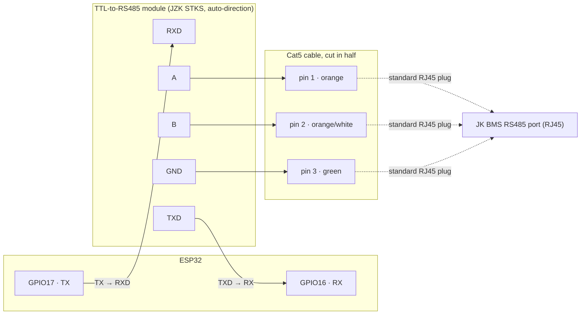
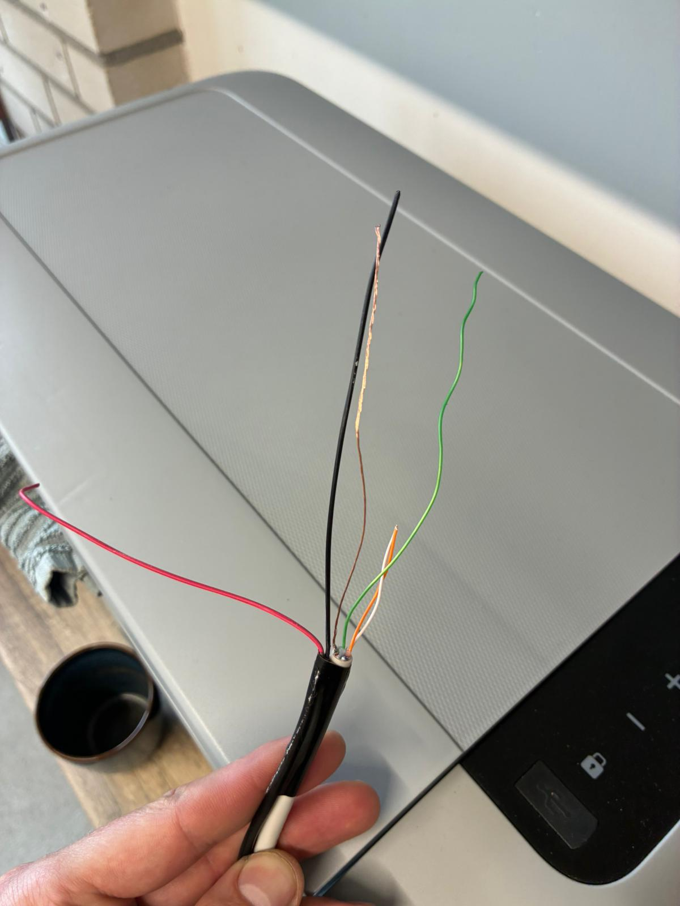
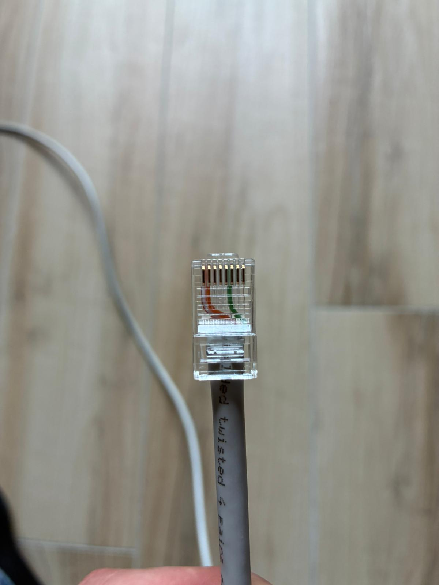

# Hardware & wiring

- Any ESP32 dev board.
- A TTL-to-RS485 transceiver. This build uses a **JZK STKS** module, which senses transmit/receive
  direction automatically — no `de_pin` needed. An old-style MAX485/SP3485 breakout with separate
  DE/RE pins (tied together, driven from a GPIO) works too; see `de_pin` in the config reference.
- Wired onto the JK RS485 parallel bus, at an address with **no physical battery** (`15` by
  default).
- 115200 baud, 8N1.

## Wiring



| ESP32 | Module | Cat5 pin | Wire |
|---|---|---|---|
| GPIO17 (TX) | RXD | — | — |
| GPIO16 (RX) | TXD | — | — |
| 3V3/5V | VCC | — | — |
| GND | GND | — | — |
| — | A | pin 1 | orange |
| — | B | pin 2 | orange/white |
| — | GND | pin 3 | green |

Note the crossover: ESP32 **TX** goes to the module's **RXD**, and ESP32 **RX** goes to the
module's **TXD** — same as wiring up any two UART devices. Some modules label these pins `DI`/`RO`
instead (from the RS485 driver chip's own perspective rather than the UART side) — if yours does,
`DI` is what's labeled `RXD` here and `RO` is `TXD`. Either way: connect TX to whichever pin feeds
into the module, and RX to whichever pin comes out of it.

Using an old-style MAX485 module instead? Add a `GPIO4 → DE + RE (tied together)` connection and
set `de_pin: GPIO4` in the YAML (see [Configuration reference](configuration.md)).

Some other modules (eg. Waveshare's RS485 boards) also need active direction control like this —
without it, they simply never transmit — but don't behave well with `de_pin` above, which toggles
the pin in software around each response. If that's the case, try ESPHome's own UART-level
`flow_control_pin` instead, set directly on the `uart:` block (and leave `de_pin` unset in the
`jkbms_ghost_battery:` block):

```yaml
uart:
  id: jkbms_uart
  tx_pin: GPIO17
  rx_pin: GPIO18
  flow_control_pin: GPIO21
  baud_rate: 115200
  data_bits: 8
  parity: NONE
  stop_bits: 1
```

This is a different mechanism from `de_pin`: the UART driver itself toggles the pin, timed to
each byte in hardware, rather than this component switching it in software before/after sending -
worth trying if a module needs direction control and `de_pin` isn't reliable for it.

The Cat5 cable's other end is a standard, unmodified RJ45 plug into the BMS's RS485 port — same
connector the JK Windows tool or Solar Assistant would use.

> Check your specific module's datasheet before tying VCC to 3.3V — most read RXD/TXD (and DE/RE,
> if present) fine at 3.3V logic even when VCC itself needs 5V, but that varies by board.
>
> Unlike the M5Stack RS485 base (which has internal pulldowns), a bare RS485 module needs the
> ground wire (pin 3, green) connected for reliable communication.

## Soldering / assembly

Tools: soldering iron + solder, wire strippers, heat-shrink tubing (or electrical tape), a
multimeter for continuity checks, and a lighter/heat gun for the heat-shrink.

1. **ESP32 → module.** If your module only has bare through-hole pads for RXD/TXD/VCC/GND
   (labeled `DI`/`RO` on some boards), solder short wires (or a 4-pin header, if you'd rather use
   Dupont jumpers) onto those four pads. Solder the other ends to the ESP32's GPIO17 (TX) →
   module RXD/DI, GPIO16 (RX) → module TXD/RO, 3V3/5V → VCC and GND → GND — or to headers on the
   dev board if it has them already, no need to solder straight to the board itself.
2. **Prepare the Cat5 cable.** Cut a Cat5/Cat5e cable roughly in half. On the BMS end, leave the
   factory RJ45 plug untouched. On the module end, strip ~3cm of outer jacket, untwist the pairs,
   and identify pins 1 (orange), 2 (orange/white) and 3 (green) by the standard T568 colors. You
   only need these three wires — trim the other five short so they can't short anything.
3. **Connect A/B/GND to the module.** Strip ~5mm of insulation off pins 1, 2 and 3 and tin them
   with a light coat of solder.
   - **Screw-terminal module:** loosen the terminal screws, insert pin 1 → `A`, pin 2 → `B`,
     tighten. No soldering needed here.
   - **Solder-pad module:** solder pin 1 to the `A` pad and pin 2 to the `B` pad directly.
   - Either way, solder (or terminal-connect) pin 3 to the module's `GND` pad/terminal.
4. **Insulate every joint.** Slide heat-shrink over each solder joint before soldering the next
   one (easy to forget), then shrink it once cool. This sits next to a battery bank — a stray
   strand shorting `A` to `GND`, or two 5V/GND wires touching, is worth the extra minute.
5. **Check before powering on.** With everything unpowered, use a multimeter in continuity mode
   to confirm: `A` and `B` aren't shorted to each other or to `GND`, and there's no continuity
   between your 5V/VCC wire and `GND`. Then power up and plug the RJ45 end into the BMS.

## Not seeing the ghost battery, or a pack dropping out?

If a pack (or the ghost itself) doesn't show up at all, or intermittently drops off the bus, even
though wiring and `pack_addresses` both check out, the cause is often signal interference on the
cable itself rather than anything in the config. This isn't a "long cable" problem specifically —
it's been seen on runs as short as ~30cm just as much as on a 20m run, and it has nothing to do
with how many packs you have; it can happen with a single pack just as easily as with several.
It's also not reliably fixed by adding another termination resistor: each JK BMS already carries
its own internal 120Ω termination, so with more than one pack on the bus you already have multiple
of those in parallel (eg. ~60Ω total with two) — adding a third resistor at the adapter end only
pushes that further from the ~120Ω target instead of closer to it.

A community-reported fix that resolved exactly this (tested from ~30cm up to a 20m run). The key
material requirement is a **shielded (FTP) cable** instead of plain unshielded Cat5 — the fix
depends on that foil/drain shield being present at all:

1. Use an **FTP (foiled twisted pair) cable**, and only use its differential pair (A/B) plus one
   extra core for a signal ground, alongside the cable's own foil shield/drain wire. Exact core
   colors vary by cable brand — go by position/function (pair vs. ground vs. drain), not by the
   colors in the photos below, which won't necessarily match what you're holding.
2. At the **battery/pack end**, connect only the pair (A/B) and the ground core — leave the
   cable's foil shield/drain wire disconnected here.
3. At the **RS485 adapter end**, twist the shield/drain wire together with the ground core and
   the minus (`-`) of the adapter's own power supply, and cover with heat-shrink.

| Shield + ground twisted together at the adapter end | Pack-side RJ45 plug |
|---|---|
|  |  |

The key detail is grounding the shield at only **one** end (the adapter side), not both — grounded
at both ends it forms a ground loop that made the problem worse; left fully floating, it gave no
shielding at all and only worked up to ~2m. Single-point shield grounding gives both: no ground
loop, and real shielding against the interference between the packs' own bus traffic — which is
the actual cause of the reflections here, since adding proper termination at the adapter isn't an
option (already ~60Ω from the packs' own built-in resistors).

As an aside from the same report: a module driving a stronger RS485 signal (measured ~7-8V vs.
~3-4.6V from a basic TTL-to-RS485 chip driven straight off an ESP32's 3.3V/5V) was noticeably more
reliable on the same cable — closer to the signal level the JK BMS's own transceivers use.
Anecdotal, not independently verified here, but worth knowing if you're choosing between modules
and still seeing dropouts after the shielding fix above.
